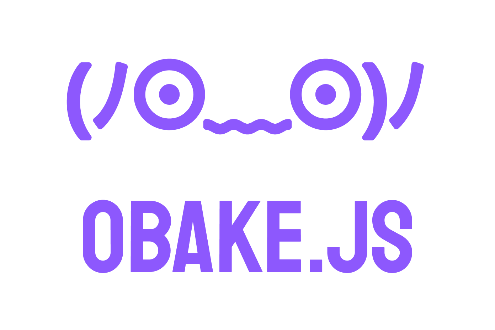

<p align="center">
</p>
<p align="center">Statement management with proxies and promise...in a spooky way</p>
<hr>
<p align="center">
<a href="https://opensource.org/licenses/MIT">
  
</a>
</p>

---

# Installation

```
npm install obake.js --save
```

# Why make this?

- I found objects in javascript and that have mutation listeners
- they allow for valuation |･д･)ﾉ	
- promise based so no race conditions!  ٩(ˊ〇ˋ*)و	

## Getting started

```js
// the defaultState is the state you want to proxy

//store.ts
import { reducer } from 'obake.js';

export const defaultState = {
  greeting: 'Spooky Ghost (ﾉ⊙﹏⊙)ﾉ',
 }

export const reducers = {
  updateGreeting: reducer((state, value: string) => {
    state.greeting = value;
  }),
}

//actions.ts
import { state } from './store';

export function handleGreetingClick() {
  state._update('updateGreeting', "Calm Ghost ( ´ ▿ ` )")
};

```
as you can see however it takes an reducer name which must be registered in the reducers,
this way you can't just mutate the object willy nilly.

there you go; you have reducers, you have a safe way to mutate it your store.

*Optional* function `reducer` to make your reducers easier to read and keep the return consistent but its optional

## Demo
https://obake.glitch.me/